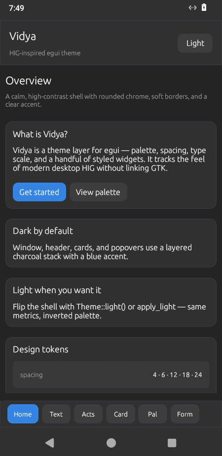
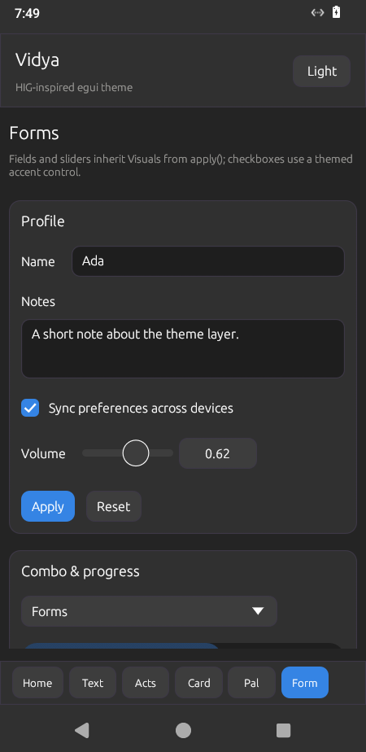
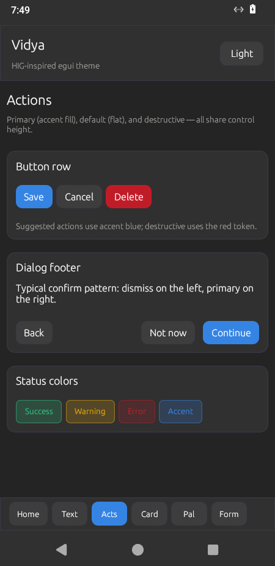
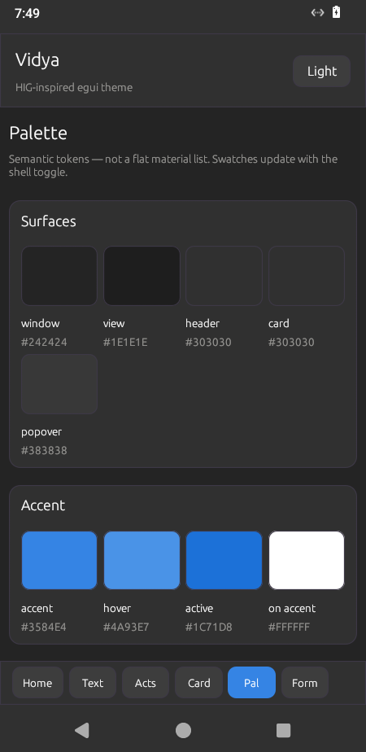
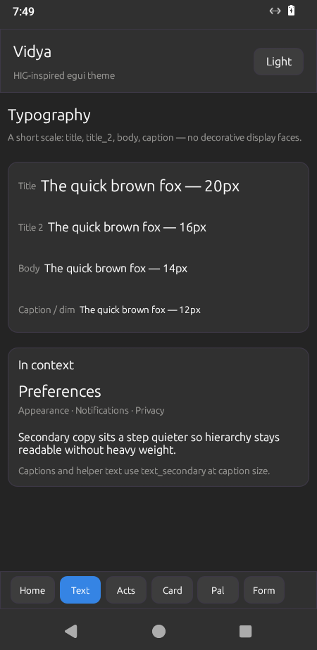
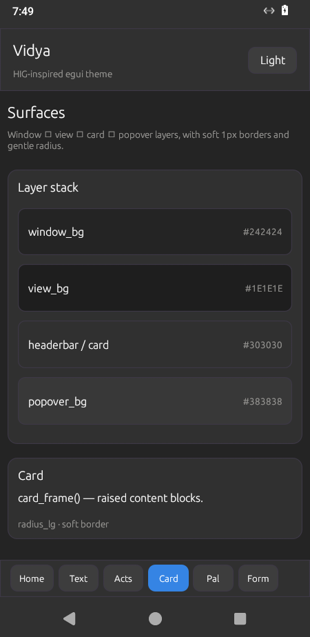

# Vidya

GNOME/HIG-inspired **theme layer for [egui](https://github.com/emilk/egui)** — no GTK.

Calm charcoal shells, a clear blue accent, soft borders, and a short type/spacing scale. **Dark is the product default** — ship `apply_dark` / `Theme::dark()` and stop there. Light (`Theme::light` / `apply_light`) exists for the showcase and for apps that explicitly need it; do not copy the demo’s dark/light toggle into every app.

**Repo:** [tangled.org/nandi.uk/vidya](https://tangled.org/nandi.uk/vidya)

Screenshots below are **Waydroid** (portrait Android) captures of the demo APK.

<p align="center">
  
  
  
</p>

<p align="center">
  
  
  
</p>

## Aesthetic

| Layer | Role |
|-------|------|
| Window / view / card / popover | Stacked surfaces (`#242424` → `#383838` in dark) |
| Accent | Adwaita-like blue (`#3584e4`) for primary actions, selection, and checked controls |
| Feedback | Destructive red, success green, warning amber |
| Type | Title 20 · title₂ 16 · body 14 · caption 12 |
| Spacing | 4 · 6 · 12 · 18 · 24 · control height 34 |
| Radius | 6 · 9 · 12 |

`apply()` installs palette + spacing on the egui context so text fields, sliders, and combos inherit the shell. Checkboxes use a dedicated themed control (`checkbox`) with accent fill and a drawn checkmark. It also registers a tiny **symbol font fallback** (DejaVu subset) so UI punctuation such as `→`, `●`/`○`, disclosure `▾`/`▴`, dashes, and curly quotes does not render as hollow boxes on Android.

**Emoji → color icons:** the full **Twemoji** 72×72 set (~3.8k glyphs) is embedded. Any reaction (flags, ZWJ sequences, skin tones) resolves via `emoji_icon` / `paint_emoji_in` / `reaction_chip`. Prefer these over raw Unicode on Android — egui’s default fonts only ship monochrome Noto Emoji.

On **Android** (edge-to-edge NativeActivity), call `reserve_system_chrome(ctx, &theme)` once per frame **before** other panels, or use `top_header(ctx, &theme, |ui| { … })` for the app chrome. That reserves the system status bar and gesture/nav band so labels and chips cannot sit under the clock / indicators.

## Demo

An interactive showcase walks through overview, typography, actions, surfaces, palette swatches, and forms. The demo includes a dark/light toggle so you can compare palettes — that control is for the showcase, not a recommended app pattern.

```bash
nix run                  # apps.default → vidya-demo
nix run .#demo
# or from a remote flake:
nix run git+https://tangled.org/nandi.uk/vidya
```

```bash
nix develop            # rust (+ android target) · just · adb · GLEAM if present

just fib               # Gleam → Wasm guest + wasmtime fib(10) (no GUI)
just gleam-gui         # Gleam calculator guest smoke (multi-step, no GUI)
just gleam-shell       # Gleam TEA mini-app smoke (view opcodes, no GUI)
just gleam-str         # Gleam string ABI smoke (read/write/concat/eq, no GUI)
just gleam-app         # whole-window Gleam app (thin Vidya shell)
just host              # aesthetic showcase (desktop egui)
just showcase          # same as host (--showcase)
just waydroid          # in-tree cargo apk → install → launch on Waydroid
just install           # same as waydroid (rebuild APK)
just launch            # start installed activity only
just shots             # Waydroid screencaps → docs/screenshots/mobile/
```

`just waydroid` builds **in `android-demo/`** with the nix develop toolchain (no temp/isolated copy).

Desktop host compiles `examples/gleam_{fib,gui,shell,str}` with a wasm-capable Gleam
(`GLEAM` or `~/code/gleam`, branch `wasm`) and loads the modules via wasmtime.

- **`just gleam-str`** — host↔guest **String** marshalling (`host/src/gleam_string.rs`):
  Gleam `String` is an `i32` pointer to `{ len: u32, data: [u8; len] }` in
  exported `memory`. Host reads guest literals and writes into a high-memory
  arena (grown pages) so guest bump-alloc is left alone.
- **`just gleam-app`** — Gleam owns the **entire** window UI tree (Home / About
  navigation, counter). Rust/Vidya only opens the window, applies the dark theme,
  materializes view opcodes, and forwards button msgs into a long-lived Wasm instance.
- **`just host`** / **`just showcase`** — the aesthetic showcase. Overview still
  embeds a Gleam shell card as a preview; use `gleam-app` for the full-window experience.

Sections:

- **Overview** — hero card, design tokens + **grid DSL** metrics table (demo can flip to light)  
- **Typography** — type scale samples (grid) and hierarchy  
- **Actions** — primary / default / destructive buttons, dialog footer, status pills  
- **Surfaces** — layer stack table, card & header frames  
- **Palette** — live semantic swatches (flip the shell to compare)  
- **Forms** — themed inputs, accent checkbox, slider, combo, progress  

### Refreshing screenshots

With a running Waydroid session:

```bash
just install   # rebuild + install APK
just shots     # adb screencap per section → docs/screenshots/mobile/
```

## Use

Apps should start dark-only:

```toml
[dependencies]
vidya = { git = "https://tangled.org/nandi.uk/vidya" }
# or: vidya = { git = "ssh://git@tangled.org/nandi.uk/vidya" }
egui = "0.31"
```

```rust
use vidya::{apply_dark, checkbox, primary_button, Theme};

apply_dark(ctx);
let th = Theme::dark();
if primary_button(ui, &th, "Open").clicked() {
    // …
}
checkbox(ui, &th, &mut sync, "Sync preferences");
```

`Theme::light()` / `apply_light` are available when an app truly needs a light shell. Prefer not to expose a theme toggle unless that is a deliberate product choice (the Vidya demo does it to exercise both palettes).

### Window icon

Embed a PNG and attach it to the viewport (set Wayland `app_id` to match your `.desktop`):

```rust
use egui::ViewportBuilder;
use vidya::with_app_icon_id;

let viewport = with_app_icon_id(
    ViewportBuilder::default().with_title("I/O Usage"),
    "usage",
    include_bytes!("../assets/usage-256.png"),
);
```

## Nix flake

| Output | Role |
|--------|------|
| `apps.default` / `apps.demo` | Desktop showcase via **`cargo run`** (rustup + egui libs) |
| `packages.default` / `packages.demo` | Same launcher + `.desktop` entry |
| `packages.vidya` | Theme library sources + rlib bundle |
| `devShells.default` | just · adb · egui runtime libs (rustup for cargo) |

```bash
nix run                 # cargo run --manifest-path host/Cargo.toml
nix run .#demo
nix build .#vidya
nix develop
```

`nix run` keeps your cwd: from the checkout it rebuilds the live tree (same as `just host`). The packaged `.desktop` falls back to the flake source with `CARGO_TARGET_DIR` under `~/.cache/vidya/`.

As a flake input:

```nix
inputs.vidya.url = "git+https://tangled.org/nandi.uk/vidya";
```

## API

| Item | Role |
|------|------|
| `Theme::dark()` / `light()` | Palette + spacing + type scale (`dark` for apps; `light` optional) |
| `apply` / `apply_dark` / `apply_light` | Install on `egui::Context` (+ symbol font); prefer `apply_dark` |
| `install_symbol_font` | Fallback glyphs for arrows / disclosure triangles / bullets / quotes |
| `emoji_icon` / `paint_emoji_in` / `has_emoji_icon` | Full Twemoji color set by codepoint |
| `Icon` / `icon` / `paint_icon_in` | Named shortcuts + stroke Plus / Copy |
| `icon_button` | Square tool button with a stroke/emoji icon |
| `reaction_chip` | Themed count chip with color emoji |
| `primary_button` / `button` / `destructive_button` | Styled actions |
| `checkbox` | Accent-filled checkbox with drawn checkmark |
| `status_dot` | Live/offline circle (drawn — no Unicode tofu on Android) |
| `text_field_singleline` / `text_field_multiline` | Text inputs with field padding (fill parent width) |
| `consume_command` / `consume_escape` | Consume Cmd/Ctrl+key or Esc (platform-aware) |
| `command_shortcut_label` / `escape_label` | `"Ctrl+F"` / `"⌘F"` / `"Esc"` for tooltips |
| `title` / `title_2` / `body` / `dim_label` | Text roles |
| `Theme::header_frame` / `card_frame` / `page_frame` | Layout chrome |
| `dialog` | Centered resizable window with `card_frame` (chain size / `.show`) |
| `Theme::text_edit_margin` | Inner field padding (12×8 default) |
| **Layout composition** | Prefer these over raw `set_max_width` / `Layout` plumbing |
| `fit_width` / `fill_width` | Pin children to residual width (no edge overflow) |
| `vstack` | Non-justified vertical stack (no giant gaps in tall parents) |
| `card` | Fill-width themed card + `vstack` content |
| `compact_card` | Fixed-width card that **hugs content** (gauge / anomaly tiles) |
| `pack` | Wrap compact tiles without stretching leftover horizontal space |
| `hflow` | Wrapping horizontal row (toolbars / chips) |
| `lead_trail` | Leading field + trailing actions without clipping the actions |
| `two_col` / `side_by_side` | Responsive two-column / stack (+ pure breakpoint policy) |
| `page_body` / `central_page` | **Enforced** scrollable page: top-level content is a **grid** (`GridCtx`) |
| `page_body_cols` / `central_page_cols` | Same, with explicit top-level `ColSpec`s |
| `page_scroll` | Escape hatch: scroll + width pin only (no grid) |
| `GridCtx::section` | Full-width page section (one row / one cell) — preferred page building block |
| `inset_row` | Soft inset row capped to parent width |
| `grid` / `grid_cols` | **Grid DSL** — pinned to residual width; cols share viewport budget |
| `grid_cols_with` / `GridOpts` | Grid with striping / spacing options (page shell uses non-striped) |
| `distribute_col_max` | Pure policy: per-column max widths so sum + gaps ≤ available |
| `ColSpec` | `Flex` / `Fixed` / `MetricBps` / `MetricRate` (floors; capped by residual) |
| `metric_cell` | Right-edge mono metric; clipped to column budget |
| `RowDsl` | `heading` / `text` / `dim` / `warn` / `metric` / `metric_bps` / `metric_rate` |
| `metric_bps` / `metric_rate` | Fixed-width monospace rate strings (no staircase columns) |
| `metric_cell` / `table_metric` / `table_text` | Low-level cells (prefer the row DSL) |
| `data_table` | Index-callback table helper on top of the grid DSL |
| `reserve_system_chrome` / `system_chrome` | Android status + nav safe areas |
| `top_header` | Header panel with system chrome already reserved |
| **App icon** | Embed a PNG as the native window icon |
| `icon_data_from_png` | Decode PNG bytes → `egui::IconData` |
| `with_app_icon` | `ViewportBuilder` + embedded PNG icon |
| `with_app_icon_id` | Same + Wayland `app_id` (match `.desktop` / `StartupWMClass`) |
| `try_with_app_icon` / `try_with_app_icon_id` | Fallible variants |

## License

MIT
